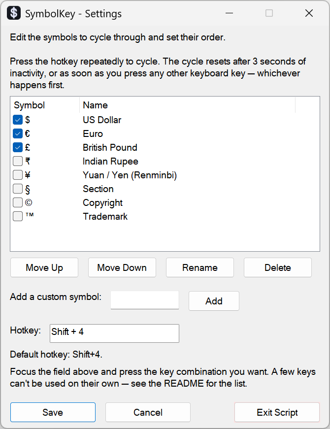

# SymbolKey

SymbolKey is a tiny AutoHotkey v2 utility for Windows that lets you type hard-to-reach symbols with one hotkey.

Press your chosen hotkey once to cycle through symbols such as `$`, `€`, `£`, `₹`, and `¥`, but it is not limited to currency. You can use it for legal marks, typographic marks, math symbols, arrows, emoji, or any custom symbol you add. This makes one key combination work for symbols you might otherwise search for, copy, paste, or memorize Alt codes for.

## Features

- Type useful symbols from any app with a single configurable hotkey.
- Press the hotkey repeatedly to cycle through enabled symbols in order.
- Built-in examples include `$`, `€`, `£`, `₹`, `¥`, `§`, `©`, and `™`.
- Add your own symbols, rename them, enable or disable them, and reorder the cycle.
- Choose your own hotkey with a standard Windows hotkey picker.
- Optionally hide the Settings window on startup so SymbolKey launches straight to the tray.
- Settings persist automatically between sessions.
- Runs quietly from the Windows system tray.

 

## Why SymbolKey exists

I kept searching the web for things like "gbp symbol", "euro symbol", "rupee symbol", "yen symbol", "copyright symbol", and "section sign", then copying the character from the results. That is slow for something that should take one keystroke.

Key remapping tools help with simple substitutions, but they usually map one key or key combination to one output. SymbolKey is different: one configurable hotkey can cycle through a list of symbols that you control.

## Good Uses

| Use case | Examples |
| --- | --- |
| Prices and invoices | `$`, `€`, `£`, `₹`, `¥` |
| Legal or business text | `§`, `©`, `™`, `®` |
| Editing and writing | `–`, `—`, `…`, `•` |
| Notes and checklists | `→`, `✓`, `✗`, `★` |
| Math and technical notes | `±`, `×`, `÷`, `≤`, `≥` |
| Personal shortcuts | Any symbol or short Unicode text you add |

## Installation & Usage

### Compiled .exe

1. Just download the latest executable from the [Releases](../../releases/latest) page and run it!
2. On every run, the Settings window opens automatically so you can configure your symbols and hotkey. (You can turn this off with the **Don't show this window on startup** checkbox once you're set up.)
3. Press the hotkey anywhere to type the first enabled symbol. The default hotkey is `Shift+4`.
4. Press the hotkey again within 3 seconds to replace the symbol with the next enabled symbol.

### Raw script .ahk

You can also inspect the script and run it yourself. 

1. Download and install [AutoHotkey v2](https://www.autohotkey.com).
2. Download `SymbolKey.ahk` from this repo.
3. Double-click `SymbolKey.ahk` to run it.
4. (Optional) To compile the .exe yourself, use the Ahk2Exe utility that comes with AutoHotkey. Point it to the script and the .ico file.

### Run on startup/logon

To start SymbolKey automatically when you log in, create a shortcut to `SymbolKey.exe` or `SymbolKey.ahk` and place it in your Windows Startup folder (`shell:startup`).

## Configuration

Right-click the tray icon and choose **Settings** to open the configuration window at any time.

| Setting | What it does |
| --- | --- |
| Enable or disable symbols | Check or uncheck symbols to include or exclude them from the cycle. |
| Reorder symbols | Select a row and use **Move Up** or **Move Down**. The list order is the cycle order. |
| Rename symbols | Double-click a row or select it and click **Rename**. |
| Add a custom symbol | Type the symbol into the text field and click **Add**. |
| Delete a custom symbol | Select the custom row and click **Delete**. |
| Change the hotkey | Focus the hotkey field and press the key combination you want. |
| Hide the window on startup | Check **Don't show this window on startup**. SymbolKey then launches straight to the tray on subsequent runs; open Settings again from the tray icon whenever you need it. |

All settings are saved to `SymbolKey.ini`, stored next to the script, and loaded automatically the next time SymbolKey runs. You can safely delete the `.ini` file; it will be recreated on the next run.

## Hotkeys That Can't Be Set

The hotkey picker is a standard Windows control, and it does not accept a few combinations. If you press one of these, the field reverts to your last valid hotkey rather than clearing:

| Hotkey type | Why it does not work |
| --- | --- |
| A modifier key on its own, such as `Shift`, `Ctrl`, or `Alt` | A hotkey needs a normal key in addition to any modifiers. |
| `Ctrl+Tab` | Windows reserves it for switching between tabs or windows. |
| Anything combined with `Backspace` or `Delete` | The picker uses those keys to clear the field, so it cannot record them as part of a hotkey. |

Pick a different combination, such as a letter, digit, or function key with optional modifiers.

The tray icon menu also offers **Reload** to restart the script after editing settings or the file, and **Exit** to close SymbolKey.

## How Cycling Works

Each hotkey press either types the next symbol or replaces the one just typed, depending on timing:

1. First press: types the first enabled symbol in your configured order, such as `$`.
2. Press again within 3 seconds: SymbolKey backspaces the previous symbol and types the next one, such as replacing `$` with `€`.
3. Keep pressing: SymbolKey continues through the list, such as `€` to `£` to `₹`.
4. After the last enabled symbol: SymbolKey cycles back to the beginning.

### When The Cycle Resets

The cycle resets, so the next hotkey press starts over from the first symbol, as soon as either of these happens:

| Reset trigger | Result |
| --- | --- |
| The 3-second window elapses | The next hotkey press starts a new cycle from the first enabled symbol. |
| You press any other keyboard key | The current cycle ends immediately. This includes arrows, Home/End, Page Up/Down, Delete, Enter, Tab, Escape, and regular characters. |

Holding a modifier key such as `Shift` or `Ctrl` by itself does not reset the cycle, since modifiers are commonly held while pressing a hotkey.

## Troubleshooting

| Problem | What to try |
| --- | --- |
| A symbol does not appear in one app | Try another app first. Some apps handle simulated Unicode input differently. |
| Cycling leaves a stray character | The target app may not process simulated backspace cleanly. Increase caution with multi-code-unit symbols such as some emoji. |
| Nothing types in a password box or secure field | Secure fields may block simulated keystrokes by design. |
| The hotkey field shows `None` while setting a hotkey | Choose a supported combination. `Backspace`, `Delete`, lone modifiers, and some reserved Windows shortcuts cannot be captured. |
| Settings disappeared | Check whether `SymbolKey.ini` is next to `SymbolKey.ahk`. If it is missing, SymbolKey recreates it with defaults. |

If you can't get it to work, [create a new issue](https://github.com/sstoilovABLE/currency-switcher/issues/new).

## FAQ

### Can SymbolKey type currency symbols?

Yes. The defaults include common currency-symbol examples like `$`, `€`, `£`, `₹`, and `¥`, and you can add others.

### Can I use it for non-currency symbols?

Yes. SymbolKey can insert any symbol or short Unicode text that AutoHotkey can send with `SendText`.

### Is this the same as an Alt-code tool?

No. Crucially, **Alt codes require having a NumPad** on your keyboard, as well as remembering numeric codes. Alt codes can also vary by environment. SymbolKey gives you a simple configurable hotkey and a visible list of symbols.

### Can I change the default `Shift+4` hotkey?

Yes. Open **Settings**, focus the hotkey field, and press the new key combination.

### Where are settings stored?

Settings are stored in `SymbolKey.ini` next to the script.

## Notes / Limitations

- Some applications handle simulated backspace or Unicode input differently, which can occasionally leave stray characters or fail to delete cleanly.
- Secure/password input fields may block simulated keystrokes entirely.
- Custom symbols made up of multiple code units, such as some emoji, may not always delete cleanly with a single backspace in every application.
- The project icon PNGs were generated with help from Claude Code. The `.ico` file was created manually with Greenfish Icon Editor Pro so the compiled executable can use the different PNGs at different icon sizes.

## Continuous Integration & Releases

The repository uses two GitHub Actions workflows, defined in `.github/workflows/`. Both run on Windows runners so they exercise AutoHotkey in its native environment.

| Workflow | File | Trigger | What it does |
| --- | --- | --- | --- |
| AutoHotkey lint | `autohotkey-lint.yml` | On every push, and on pull requests targeting `main` | Installs AutoHotkey v2, runs a syntax check (`/Validate`) on `SymbolKey.ahk`, and enforces a few best practices: the script must declare `#Requires AutoHotkey v2` and `#SingleInstance`, must not contain trailing whitespace or hardcoded user-profile paths. |
| Release | `release.yml` | Manually via **Run workflow**, or automatically when a tag is pushed | Installs AutoHotkey v2 and the Ahk2Exe compiler, compiles `SymbolKey.ahk` into `SymbolKey.exe` (using `SymbolKey.ico` for the icon), uploads it as a build artifact, and publishes a GitHub release with the compiled executable attached. |

### Cutting a release

The Release workflow derives the release tag from the ref it runs on, so publish it **from a tag**:

- **Push a tag** (for example `v1.0`) to trigger the workflow automatically, or
- Use **Actions → Release → Run workflow** and select the tag as the ref.

Use an **annotated** tag (`git tag -a v1.0 -m "…"`); the workflow pulls the release notes from the tag message (`--notes-from-tag`). The `dry_run` input defaults to `true`, which compiles and uploads the artifact but skips publishing — set it to `false` to actually create the release. The workflows install the latest AutoHotkey and Ahk2Exe releases from the GitHub API using the built-in workflow token, so no additional secrets are required.

## License

MIT - see [LICENSE](LICENSE).
